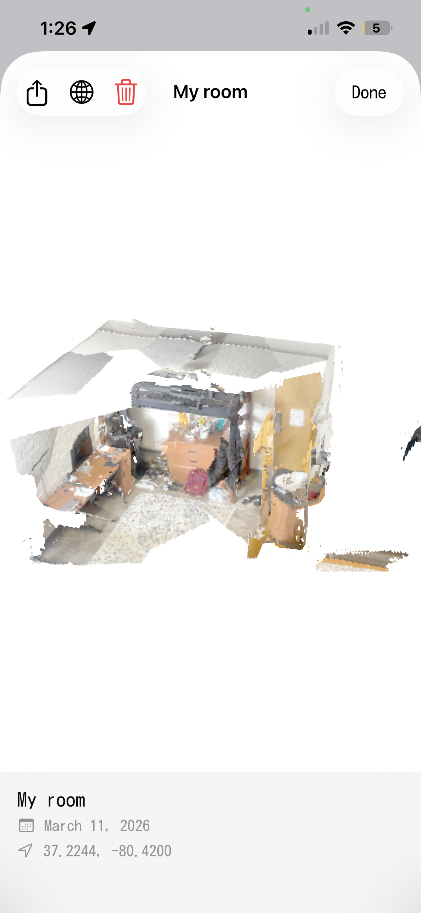
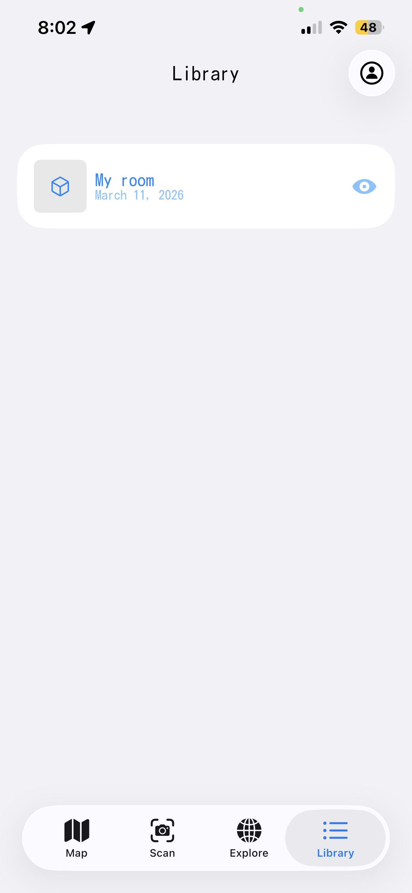

# AnchorMap

An iOS app that uses LiDAR to capture 3D room scans, colorizes them in real time, and lets users geotag and share scans on a collaborative map via CloudKit.

<table>
  <tr>
    <td align="center"><br><b>Map View</b></td>
    <td align="center"><br><b>3D Scan Detail</b></td>
  </tr>
  <tr>
    <td align="center"><br><b>Library</b></td>
    <td align="center"><br><b>Explore</b></td>
  </tr>
</table>

## Features

- **LiDAR Scanning** — Capture 3D mesh geometry using ARKit's scene reconstruction
- **Real-Time Mesh Colorization** — Projects camera textures onto mesh vertices using camera-space projection with bilinear interpolation
- **Keyframe Pipeline** — Background JPEG encoding with nearest-neighbor eviction to maintain spatial diversity across 50 keyframes
- **Geotag & Publish** — Tag scans with GPS coordinates and publish to CloudKit's public database
- **Explore Map** — Browse and download scans published by other users via an interactive MapKit view
- **3D Viewer** — Load and inspect scans in a SceneKit-based viewer

## Tech Stack

| Layer | Technology |
|-------|-----------|
| UI | SwiftUI |
| AR | ARKit, RealityKit |
| 3D Rendering | SceneKit |
| Cloud | CloudKit (public database) |
| Maps | MapKit, CoreLocation |
| Concurrency | GCD, async/await |

## Architecture

```
AnchorMap/
├── ARManager.swift          # AR session, location services
├── ARWrapper.swift          # SwiftUI ↔ ARKit bridge, LiDAR capture
├── Mesh+Ext.swift           # Mesh colorization & vertex processing
├── Models/
│   ├── CloudKitManager.swift  # CloudKit publish/fetch/download
│   ├── ScanRecord.swift       # Local scan data model
│   └── PublicScan.swift       # Public scan model
├── Views/
│   ├── MapView.swift          # Geotagged scan map
│   ├── ExploreView.swift      # Browse public scans
│   └── ScanDetailView.swift   # Scan detail & 3D viewer
├── ContentView.swift
└── FetchModelView.swift
```

## Getting Started

### Requirements

- iOS 17.0+
- iPhone/iPad with LiDAR sensor (iPhone 12 Pro or later)
- Xcode 15+
- Apple Developer account (for CloudKit container setup and distribution)

### Setup  
Download on the App Store
